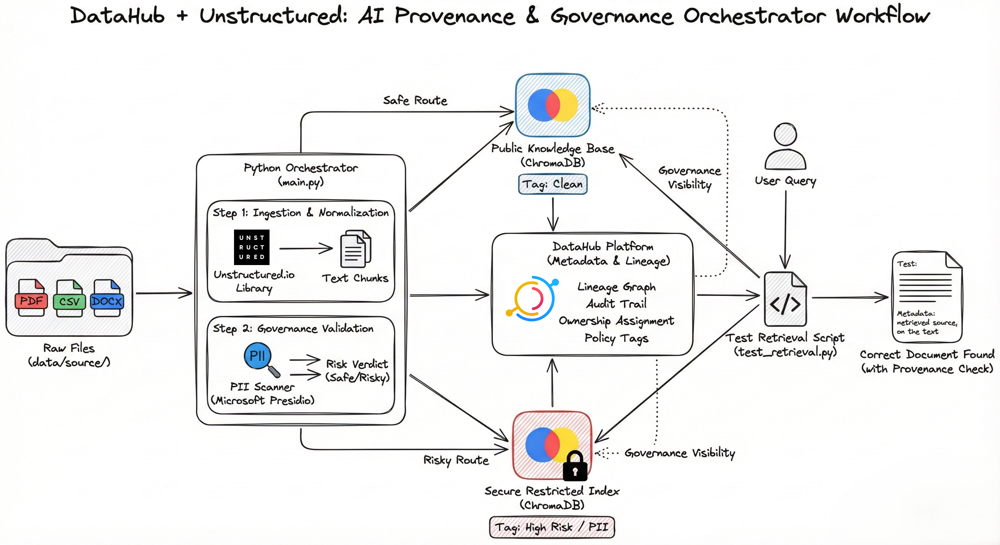

# DataHub + Unstructured: AI Provenance & Governance Orchestrator 🌱

A connector tool that bridges [Unstructured.io](https://unstructured.io/) (File Ingestion) with [DataHub](https://datahub.com/) (Metadata Governance) to enforce safety in RAG pipelines.


## 🔌 What is this tool?

This project is a custom integration that connects the Unstructured ecosystem with DataHub.

Building a large RAG pipelines often leads to "Data Blindness." We dump thousands of PDFs and CSVs into vector databases without checking exactly what is inside them or tracking where the AI gets its answers. While Unstructured is amazing at extracting text from these messy files, it doesn't inherently govern them.

This tool fills that gap. It acts as a smart middleware that:xt from these messy files, it doesn't inherently govern them.

1. **Ingests** raw documents using Unstructured.
2. **Validates** them against governance policies (using Presidio).
3. **Syncs** the metadata, lineage, and risk tags directly into DataHub.

Effectively, it turns opaque files (black boxes) into transparent, governed assets within DataHub.

## 💡 The Problem It Solves

Without this integration, it is easy to lose track of what actually feeds your models:
- **Missing Lineage:** You know you have a vector database, but you can't trace a specific vector back to the original PDF source. This tool fixes that by drawing the line from Source File $\rightarrow$ Unstructured Chunk $\rightarrow$ Vector Index.
- **Stops "Shadow AI":** Tags sensitive data (like Credit Cards or SSNs) from entering your public AI knowledge base.
- **Metadata Enrichment:** Automatically captures file size, risk levels, and "owners" without manual data entry.

## ⚙️ How the Integration Works

It performs 4 keys steps:

1. **Normalization (Unstructured Integration):** It leverages the `unstructured` library to break down complex file formats (PDF, DOCX, TXT) into standardized text chunks.
2. **Governance Check (Policy Validation):** Before storage, it runs every text chunk through Microsoft Presidio to catch PII (Personally Identifiable Information). This satisfies the "Validate Governance Policies" requirement by flagging sensitive entities.
3. **Routing Logic:**
  - Safe Data $\rightarrow$ Goes to the Public Knowledge Base.
  - Sensitive Data $\rightarrow$ Goes to the Secure Restricted Index (and gets tagged as "High Risk").

4. **Metadata Push (DataHub Integration):** It uses the DataHub SDK (datahub-client) to publish the lineage graph, ownership info, and risk tags immediately. So you have a searchable audit trail.
5. **Trusted Retrieval (RAG Ready):** With the data now securely isolated in ChromaDB, it is ready for generation. You can connect any LLM (OpenAI, Llama 3, etc.) to these indexes. You can try this out via a verification script `src/test_retrieval.py` to confirm that the AI respects the security boundaries set in Step 3.

## 🛠️ Prerequisites

You need these tools installed to run the show:
- Python 3.10+ ( 3.11 preferred )
- Docker Desktop (To run the local DataHub instance)
- Git

## 👉 Quick Start Guide

1. **Start the DataHub Platform**

    We need the GMS (Generalized Metadata Service) running to accept our integration's signals.
    ```Bash
    pip install acryl-datahub
    datahub docker quickstart
    ```
2. **Install Integration Dependencies**
    ```bash
    pip install -r requirements.txt
    python -m spacy download en_core_web_lg  # Required for the NLP Governance engine
    ```

3. **Generate Synthetic Data (Optional)**

    To test the integration effectively, I've included a generator that creates synthetic "Risky" (PII-laden) and "Safe" documents. You can also try with Kaggle Datasets like [SEC Filings](https://www.kaggle.com/datasets/finnhub/sec-filings), [Company Financial Reports](https://www.kaggle.com/datasets/atharvaarya25/financials) or this [Dataset of PDF Files](https://www.kaggle.com/datasets/manisha717/dataset-of-pdf-files) to simulate real world heavy workloads.

    ```bash
    # Generates test artifacts in data/source/
    python src/generate_synthetic_data.py
    ```

4. **Run the Connector**

    This script executes the full pipeline: Ingest $\rightarrow$ Scan $\rightarrow$ Route $\rightarrow$ Push Metadata.

    ``` bash
    python src/main.py
    ```
5. **Verify the Integration**
 - **Test Retrieval:** Run python src/test_retrieval.py to see if the AI can fetch the data.
 - **Governance Check**: Open http://localhost:9002 (User/Pass: datahub). Search for "pinecone" or "financial". You will see the full lineage graph, ownership assignments, and risk tags.


## 🎛️ Modifying the Logic
This tool is designed to be extensible for other DataHub use cases:
- `src/config.py`: Update this if you are connecting to a remote DataHub or ChromaDB instance.
- `src/ingestion/loader.py`: Modify this to change how Unstructured parses files (e.g., add OCR strategies).
- `src/governance/datahub_client.py`: This is the core DataHub connector file. Edit this to add more custom metadata or change the ownership assignment logic.


Tech Stack
- **Integration Core:** DataHub SDK + Unstructured SDK
- **Governance Engine:** Microsoft Presidio
- **Storage:** ChromaDB (Vector Store)
- **LlamaIndex:** For connecting data to LLMs.

## 🔮 Future Roadmap
This project is currently an Architectural Prototype. Here is the vision for v2.0:

- **Generative Layer:** Integrate LiteLLM to connect the retrieval layer to models like GPT 4 or Llama 3, turning this from a "Search Engine" into a full "Chat with your Data" application.
- **Drag and Drop UI:** Build a  frontend to allow easy upload files and see the "Safe/Risky" verdict in real time.
- **Dynamic Policy Engine:** Move the hardcoded Python rules into a YAML configuration file, allowing Security Teams to update PII rules without touching the code.

## 📄 License
This project is available under the **MIT License**. Feel free to clone, modify, and use it in your own governance pipelines.

## 👤 Author

**Lakshay Nasa**

[LinkedIn](https://www.linkedin.com/in/lakshaynasa/)
